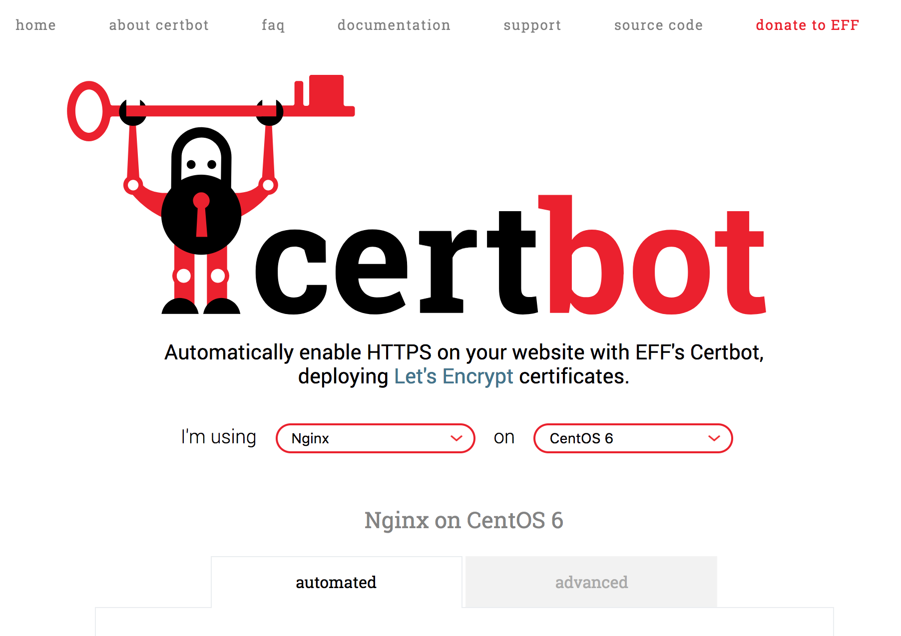

# 申请Let's Encrypt的SSL证书，拥抱HTTPS 

[Let's Encrypt官网配置教程](https://certbot.eff.org/#centos6-nginx) 

### 选择服务器类型和系统环境


### 登录服务器安装插件
首先登录到自己的远程服务器，然后安装Let's Encrypt官网提供的插件，用来生成证书。此处示例把插件安装在目录/usr/local里。
> [root@iZbp14vaxib09 ~]# cd /usr/local  
> [root@iZbp14vaxib09 local]# wget https://dl.eff.org/certbot-auto

```  
--2017-05-14 21:49:45--  https://dl.eff.org/certbot-auto  
正在解析主机 dl.eff.org (dl.eff.org)... 151.101.72.201, 2a04:4e42:11::201  
正在连接 dl.eff.org (dl.eff.org)|151.101.72.201|:443... 已连接。  
已发出 HTTP 请求，正在等待回应... 200 OK  
长度：57381 (56K) [application/octet-stream]  
正在保存至: “certbot-auto”  

100%[==============================================================================>] 57,381       140KB/s 用时 0.4s  

2017-05-14 21:49:47 (140 KB/s) - 已保存 “certbot-auto” [57381/57381])  
```  

### 赋予可执行权限
> [root@iZbp14vaxib09 local]# chmod a+x certbot-auto  

### 生成证书
生成证书时可提供邮箱地址、虚拟目录路径以及绑定的域名。  
sudo ./certbot-auto certonly --email 邮箱地址 --webroot -w 虚拟目录路径1 -d 绑定的域名1 -w 虚拟目录路径2 -d 绑定的域名2  

> [root@iZbp14vaxib09 local]# sudo ./certbot-auto certonly --email 127*****92@qq.com --webroot -w /root/webroot/h5 -d h5.xxx.com

```
Saving debug log to /var/log/letsencrypt/letsencrypt.log  
Plugins selected: Authenticator webroot, Installer None  
Obtaining a new certificate  
Performing the following challenges:  
http-01 challenge for h5.xxx.com  
Using the webroot path /root/webroot/h5 for all unmatched domains.  
Waiting for verification...  
Cleaning up challenges

IMPORTANT NOTES:  
- Congratulations! Your certificate and chain have been saved at:
  /etc/letsencrypt/live/h5.xxx.com/fullchain.pem  
  Your key file has been saved at:  
  /etc/letsencrypt/live/h5.xxx.com/privkey.pem  
  Your cert will expire on 2018-03-12. To obtain a new or tweaked  
  version of this certificate in the future, simply run certbot-auto  
  again. To non-interactively renew *all* of your certificates, run  
  "certbot-auto renew"  
 - If you like Certbot, please consider supporting our work by:  

Donating to ISRG / Let's Encrypt:   https://letsencrypt.org/donate  
Donating to EFF:                    https://eff.org/donate-le  
```

### 证书自动续签
Let's Encrypt提供的证书有效期为90天，到期需要续签。官网插件很友好地提供了自动续签的服务。  
> [root@iZbp14vaxib09 local]# ./certbot-auto renew --dry-run

```
Saving debug log to /var/log/letsencrypt/letsencrypt.log

-------------------------------------------------------------------------------
Processing /etc/letsencrypt/renewal/h5.xxx.com.conf
-------------------------------------------------------------------------------
Cert not due for renewal, but simulating renewal for dry run
Plugins selected: Authenticator webroot, Installer None
Renewing an existing certificate
Performing the following challenges:
http-01 challenge for h5.xxx.com
Waiting for verification...
Cleaning up challenges

-------------------------------------------------------------------------------
new certificate deployed without reload, fullchain is
/etc/letsencrypt/live/h5.xxx.com/fullchain.pem
-------------------------------------------------------------------------------

-------------------------------------------------------------------------------
** DRY RUN: simulating 'certbot renew' close to cert expiry
**          (The test certificates below have not been saved.)

Congratulations, all renewals succeeded. The following certs have been renewed:
  /etc/letsencrypt/live/h5.xxx.com/fullchain.pem (success)
** DRY RUN: simulating 'certbot renew' close to cert expiry
**          (The test certificates above have not been saved.)
-------------------------------------------------------------------------------

IMPORTANT NOTES:
 - Your account credentials have been saved in your Certbot
   configuration directory at /etc/letsencrypt. You should make a
   secure backup of this folder now. This configuration directory will
   also contain certificates and private keys obtained by Certbot so
   making regular backups of this folder is ideal.
```
生成的证书在目录/etc/letsencrypt/live/h5.xxx.com/中

### Nginx中引入证书
修改h5.xxx.com对应的Nginx配置文件，引入生成的证书和私钥文件。  

```
server {
    listen       80;
    listen       443 ssl;
    server_name  h5.xxx.com;

    ssl on;
    ssl_certificate /etc/letsencrypt/live/h5.xxx.com/fullchain.pem;
    ssl_certificate_key /etc/letsencrypt/live/h5.xxx.com/privkey.pem;
    ssl_trusted_certificate /etc/letsencrypt/live/h5.xxx.com/chain.pem;
    ssl_session_timeout 5m;

    location / {
        root   /root/webroot/h5;
        index  index.html index.htm;
    }
}
```

### 重启Nginx
> [root@iZbp14vaxib09 local]# /usr/local/nginx/sbin/nginx -s reload  