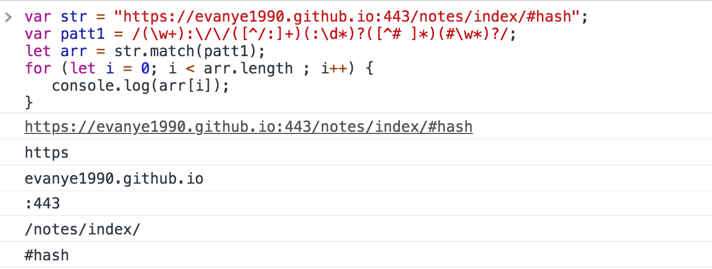

# 正则表达式（Regular Expression）

#### 常用范围
1. 匹配模式（数据验证），例如：手机号码、身份证等
2. 字符串操作，例如：替换、删除、基于模式匹配提取子字符串等

#### 普通字符

1. \w 匹配字母数字下划线, 等价于[a-zA-Z0-9_]

#### 非打印字符
1. **\s** 匹配任何空白字符(空格、制表符、换页符等), 等价于[\f\n\r\t\v]**
2. **\S** 匹配任何非空字符, 等价于[^\f\v\r\t\v]
3. \f(换页符), \t(制表符), \v(垂直制表符), \r(回车符), \cx(x=[A-Za-z], 例如\cM匹配一个Control-M或回车符)

#### 特殊字符
1. **$**: 匹配字符串结束位置, Multiline属性下也匹配\\n, \\r, 匹配本身用\\$
2. **()**: 标记字表达式开始和结束位置, 匹配本身用\\(, \\)
3. **\***: 匹配子表达式零或多次, 匹配本身用\\*
4. **+**: 匹配字表达式一次或多次, 匹配本身用\\+
5. **.**: 匹配除换行符\n之外的任何单字符, 匹配本身用\\.   (在中括号表达式中([.]只匹配本身.))
6. **[**: 匹配中括号表达式, 匹配本身用\\[
7. **?**: 匹配子表达式零次或一次, 或指明一个非贪婪表达式, 匹配本身用\\?
8. **\\**: 标记下一个字符为特殊字符或原义字符或向后引用或八进制转义符, 匹配本身用\\\\
9. **^**:  匹配字符串开始位置, 在中括号表达式中使用表示不接受该字符集合, 例如[^a-z], 匹配本身用\\^
10. **{**: 标记限定表达式开始, 匹配本身用\\{
11. **|**: 指名两项之间的选项, 匹配本身用\\|

#### 限定符
1. **\***: 匹配零次或多次, 贪婪。可用*?实现非贪婪或最小匹配
2. **+**: 匹配一次或多次, 贪婪。可用*?实现非贪婪或最小匹配
3. **?**: 匹配零次或一次
4. **{n}**: 匹配n次, n为一个非负整数
5. **{n,}**: 至少匹配n次
6. **{n,m}**: 至少匹配n次，至多匹配m次

#### 定位符
1. **^**:  匹配字符串开始位置, Multiline属性下也匹配\\n, \\r
2. **$**: 匹配字符串结束位置, Multiline属性下也匹配\\n, \\r
3. **\\b**: 匹配一个字边界, 即字与空格间的位置
4. **\\B**: 匹配非字边界 

例子

1. 匹配出protocol, host, port, pathname

> const url = 'https://evanye1990.github.io:443/notes/index/#hash';
>
> /(\w+):\/\/(\[^/:]+)(:\d\*)?(\[^# ]\*)(#\S*)?/

protocol: url中'://'之前的字符串  **(\w+):\/\/**

host:  protocol后到 : 或 / 间的字符串 (\w+):\/\/**(\[^/:]+)**

port: host后 : 后的数字, 可能缺省 (\w+):\/\/([\^\:]+)**(:\d*)?**

pathname: port后到 # 或结束的字符串, 可能无# (\w+)\/\/([\^/:]+)(:\d*)?**([\^# ]\*)**

hash: path后 # 到结束, 可能无# (\w+)\/\/([\^/:]+)(:\d*)?([\^# ]\*)**(#\w\*)?**

#### 元字符

1. \, ^,$, *, ? {n}, {n,}, {n,m}, ?, ., x|y, [abc], [\^abc], [a-z], [\^a-z], \b, \B, \d, \D,\s, \S, \w, \W

2. (pattern): 匹配 pattern 并获取这一匹配。所获取的匹配可以从产生的 Matches 集合得到。在js中则使用\$0 … \$9属性。

3. (?:partter): 匹配 pattern 非获取匹配，不进行存储。

   例如:  匹配industries 或 industry

   > const str = '4728347238industries2321industry12312'
   >
   > /(industries|industry)/  < /industr(?:ies|y)/

4. (?=pattern): 正向肯定预查, 在任何匹配pattern的字符串开始处匹配查找字符串。非获取匹配。

   例如，**Windows(?=95|98|NT|2000)** 匹配**Windows98**中的**Windows**，但不能匹配**Windows2008**中的**Windows**，所以index = 12

   

5. (?!pattern): 正向否定预查, 在任何不匹配pattern的字符串开始处匹配查找字符串。非获取匹配。

   例如，**Windows(?!95|98|NT|2000)**能匹配**Windows2003**中的**Windows**，但不能匹配**Windows2000**中的**Windows**，所以index = 0

   > Windows(?!95|98|NT|2000)

   

6. (?<=pattern): 反向肯定预查，与正向肯定预查类似，只是方向相反。

   例如，**(?<=95|98|NT|2000)Windows**能匹配**2000Window**中的**Windows**，但不能匹配**2008Window**中的**Windows**

7. (?<!pattern): 反向否定预查，与正向否定预查类似，只是方向相反。

   例如，**(?<!95|98|NT|2000)Windows**能匹配**2008Windows**中的**Windows**，但不能匹配**2000Windows**中的**Windows**

#### 运算符优先级(从高到低)

1. 转义符: \
2. 圆/方括号: \(\), \(?:), (?=), []
3. 限定符: *, +, ?, {n}, {n,}, {n,m}
4. 定位点和序列(位置、顺序): ^, $, \任何元字符, 任何元字符
5. 替换(或操作): |

#### 常用示例

1. HTML标签: 